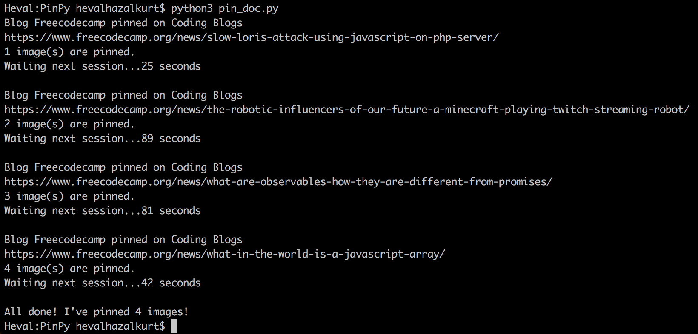
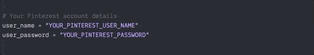
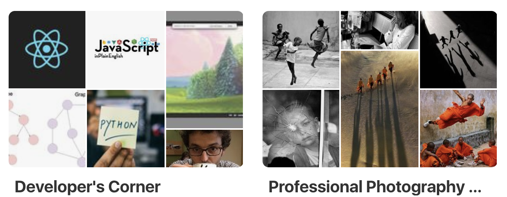
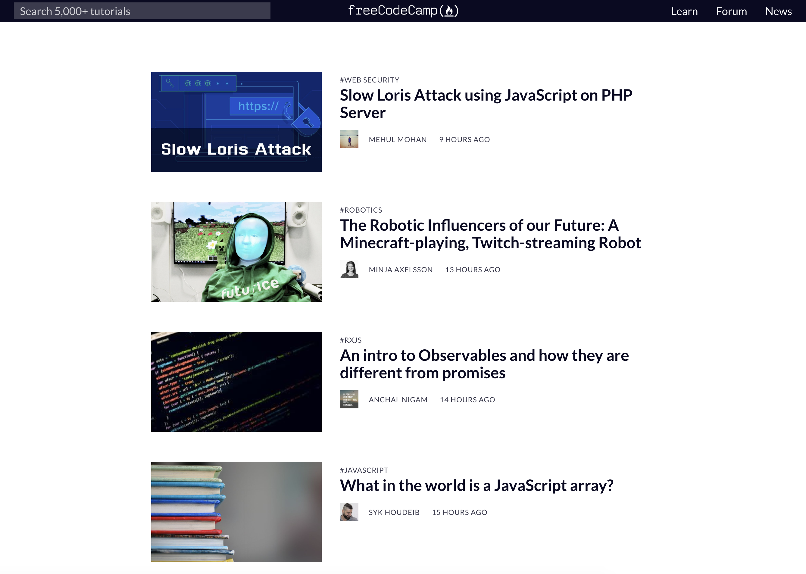
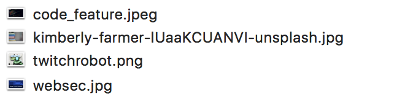
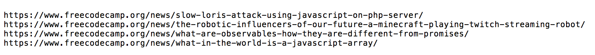
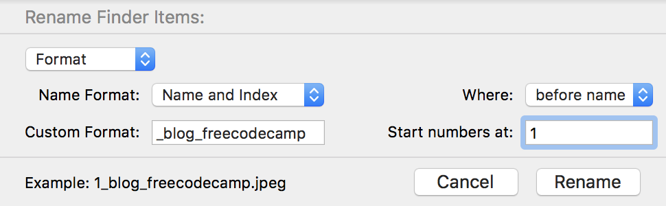
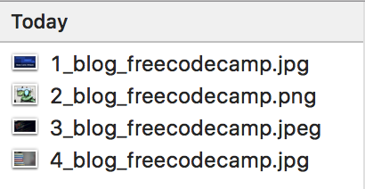

# PinPy
PinPy is a Pinterest bot that helps you to automate your Pinterest marketing strategy by bulk and smart pinning.


<br>



## How do you use PinPy?

Let me show and explain the details of how you can use PinPy step by step.

#### Install the requirements

PinPy needs a few libraries required to work. Some of these are Python's standard libraries and do not require installation. These are :

* [glob](https://docs.python.org/2/library/glob.html)
* [time](https://docs.python.org/3/library/time.html)
* [random](https://docs.python.org/3/library/random.html)
* [json](https://docs.python.org/3/library/json.html)


Besides, you must install the Selenium library. You will find a simple installation below, but if you need it, you can get more information about the library from the [website](https://selenium-python.readthedocs.io/installation.html).

Using pip, you can install Selenium like this:

`pip3 install selenium`


You will also need to download the webdriver you will use after installation. The current codes are written using the Chrome driver.

| Driver | Link |
|--|--|
|Chrome	|https://sites.google.com/a/chromium.org/chromedriver/downloads|
|Edge|	https://developer.microsoft.com/en-us/microsoft-edge/tools/webdriver/|
|Firefox|	https://github.com/mozilla/geckodriver/releases|
|Safari|	https://webkit.org/blog/6900/webdriver-support-in-safari-10/|


<br>

#### Enter your Pinterest user information




<br>


#### Define your image file path and pins' description


<br>


#### Define your Pinterest board details

Correctly editing the board details increases the content marketing success of the program. Each board is designed as a library key in the program. Let's see the template first :

```python
board_data = {"board_category_1": {
                "keywords": ["KEYWORD1", "KEYWORD2", "KEYWORD3", "KEYWORD4", "KEYWORD5"],
                "link": "//*[@title='YOUR_PINTEREST_BOARD_NAME']",
                "tags": "#HASHTAG1 #HASHTAG2 #HASHTAG3 #HASHTAG4 #HASHTAG5 #HASHTAG6"},
              "board_category_2": {
                "keywords": ["KEYWORD1", "KEYWORD2", "KEYWORD3", "KEYWORD4", "KEYWORD5", "KEYWORD6", "KEYWORD7", "KEYWORD8" ],
                "link": "//*[@title='YOUR_PINTEREST_BOARD_NAME']",
                "tags": "#HASHTAG1 #HASHTAG2 #HASHTAG3 #HASHTAG4 #HASHTAG5"},
                }
```

We will go through a real example to make it more understandable. Let's say we have two boards in our Pinterest account.



In this case, we can edit the structure like this.

```python
board_data = {"development": {
                "keywords": ["PYTHON", "JAVASCRIPT", "FREECODECAMP", "HTML", "CSS", "DEVELOPER", "PROGRAMMING", "TUTORIAL"],
                "link": "//*[@title='Developer's Corner']",
                "tags": "#developer #development #python #freecodecamp #coding "},
              "photography": {
                "keywords": ["PHOTOGRAPHY", "CAMERA", "PORTRAIT", "NATURE", "CANON", "NIKON", "PHOTO" ],
                "link": "//*[@title='Professional Photography World']",
                "tags": "#photography #photo #landscape #camera #nature #portrait "},
                }
```

Decisions about the boards can be arranged entirely according to your preferences. For example, instead of adding all development articles to the same board, you can create different boards such as Python, Javascript, React, etc. with more detailed keywords and hashtags.

There are a few things to consider when making board structures:

* Keywords should be capitalized.
* The board name in the link line should be written in the same way as it appears on the user side and the other parts of the line should not be touched.
* There is no number limit for keywords, but should not conflict with other board keywords. For example, the keyword "HOME DECOR" on the "decor" board may be confused with "HOME" on the "architecture" board. You can overcome these kinds of problems by constructing the boards correctly in the library.
* There are no number limits for hashtags, but keep in mind that this section will be added to the description of your pin and therefore should not exceed the Pinterest font limits.

<br>

#### Get the pin name

You need a pin name to keep track of the program's flow and define the Pinterest boards.


For example, you downloaded the images from the internet and the names like this : `black_and_white_ui_ux_design-r38548522b52d4124bd270cf8060f89b3_jz0n5.jpg`. As we have seen, the name of the image here is actually `black and white ui ux design`. So we can do the following to get this result.

```python
def pre_name():
    ind = img.find("-")
    product = img[:(ind)]
    pre_name = product.replace("_", " ")
    pre_name = pre_name.upper()
    return pre_name
```


At the end of the process, we have a pin named `BLACK AND WHITE UI UX DESIGN`. You can edit this section by the name of the images you have, but at the last `return` step, the name must be written in capital letters.


<br>


#### Setting hashtags

Hashtags allow your pins to reach more people. When specifying the boards, you also defined the hashtags for that board. However, if there is a more general hashtag that fixes all your pins, you can add them to this section.


<br>

## Understanding image-link pairs

PinPy matches the images in the `images` folder with the links in the  `links.txt`  document. Therefore, the order of the images and the links are necessary. You can see the code flow of this process below. You don't need to make any changes in this section, but understanding the matching process correctly can help you use the program more effectively.

```python
# Getting images from the file
image_list = []
for filename in glob.glob('images/*.jpg'):
    filename = filename[7:]
    image_list.append(filename)


# Getting links from the file
link_list = []
link_file = open("links.txt", "r")
for link in link_file:
    link = link.rstrip()
    link_list.append(link)


# Making link-image pairs
pairs = {}
for i in range(len(image_list)):
    pairs[image_list[i]] = link_list[i]
```

The program works very efficiently while sharing our own images and links. However, we may wish to share content on a website that we do not control. There are some points you need to pay attention to use the program effectively in such cases. For example, let's say that we want to share some articles from the FreeCodeCamp blog.



We have four images and links from four blog posts we want to share. These are as you can see below.






As you can see, the order of the images is not the same as the order of the links. This causes the program to make wrong image-link pairs. There are also no keywords in the image names that the program can recognize. At such times, we can try a few different solutions depending on the suitability of the situation.

* We can change the order of links in the .txt document.
* We can arrange the links in a-z order.
* We can give numbers to the images.
* We can add keywords to image names.


In our example, we can solve the problem by changing the names of the images. Since all the images are suitable for the same Pinterest board, we can make bulk naming.



As a result of this process, we were able to sort our images.



Now our images are in the same order as our links and the program can pin them to the right board by defining their content.

<br>

## Future improvements

In the following versions, I am working on a system that will pin the program by downloading images and links from a given web page. Until then, you can use the following two Chrome extensions.

* [Link Klipper](https://chrome.google.com/webstore/detail/link-klipper-extract-all/fahollcgofmpnehocdgofnhkkchiekoo?hl=en) : Extract all links on a webpage and export them to a file.
* [Download All Images](https://chrome.google.com/webstore/detail/download-all-images/ifipmflagepipjokmbdecpmjbibjnakm) : Save all images in active tab as .zip file. Easily save photos from Instagram, Google Images, etc.


<br>

#### If you want to support you can [](https://www.buymeacoffee.com/hevalhazalkurt) :)
